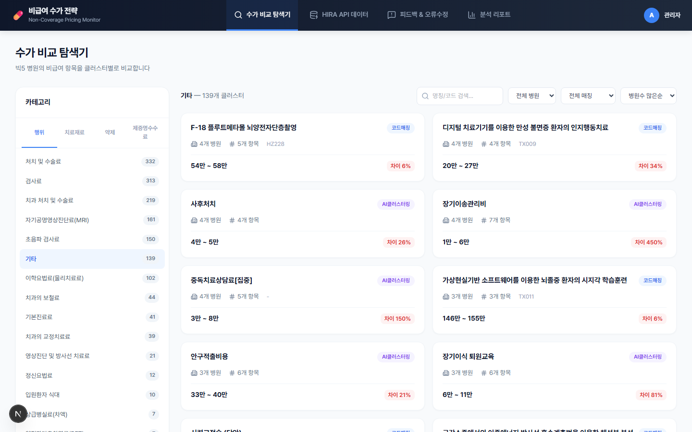
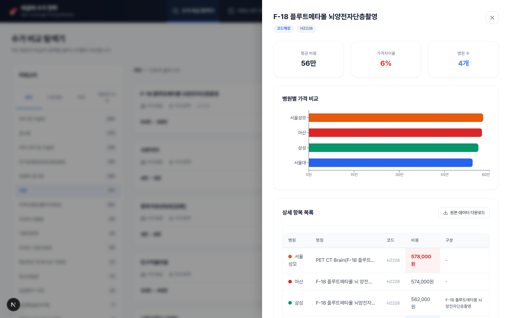
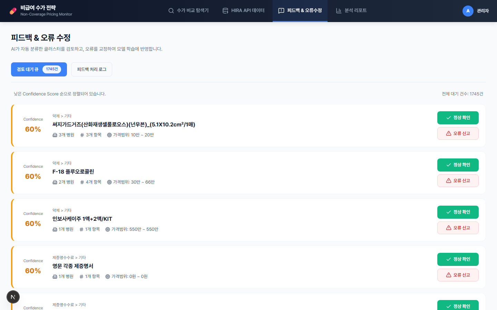

# 빅5 병원 비급여 항목 가격 비교 파이프라인

병원마다 같은 시술인데 이름을 다르게 공시해요("PET CT" vs "양전자단층촬영" 이런 식으로). 그래서 명칭만 보고는 병원 간 비급여 진료비를 비교할 방법이 없더라고요. 이 프로젝트는 그 문제를 풀려고 크롤링부터 AI 클러스터링, 사람이 검토하는 리뷰 대시보드까지 혼자 만든 파이프라인입니다.

관련 특허도 하나 출원했어요 — "환자에 대한 건강보험 급여 충족 여부를 제공하는 방법" (10-2025-0138818).

## 배경

빅5 병원(서울대·삼성서울·세브란스·아산·서울성모)은 「의료법」에 따라 비급여 항목 가격을 각자 웹사이트에 공시할 의무가 있습니다. 근데 막상 데이터를 모아보려니:

- 병원마다 명칭도 분류 체계도 다 달라서 단순 비교가 안 됨
- 페이지 구조도 병원마다 완전히 달라서 수집 자체가 일
- 표준 코드가 있는 항목은 그나마 낫지만, 없는 항목(꽤 많음)은 AI로 유사한 것끼리 묶어줘야 함

## 스크린샷

| 탐색기 | 클러스터 상세 | 리뷰 큐 |
|---|---|---|
|  |  |  |

## 구조

```
1_crawler/     병원별 크롤러 5개 (Selenium, config 기반)
      ↓
2_processor/   정제 → EDI 코드 매칭 → BERT 클러스터링 → Supabase 적재
      ↓
3_dashboard/   Next.js 리뷰/탐색 대시보드
```

**크롤러**는 병원마다 탭 전환/페이지네이션/DOM이 다 달라서 꽤 손이 갔어요. `base_crawler.py`가 공통 로직(재시도, 로깅)을 담당하고, 병원별 크롤러(`snu_crawler.py`, `samsung_crawler.py`, `severance_crawler.py`, `asan_crawler.py`, `cmc_crawler.py`)가 각자 사이트 특성에 맞춰 구현돼있습니다. stale element 재탐색이나 JS 클릭 폴백 같은 것도 넣었어요.

셀렉터/URL은 크롤러 코드가 아니라 별도 config에서 관리하는 구조로 짰습니다. 다만 `config/big5_config.example.json`은 스키마만 보여주는 예시고, 실제 대상 병원 URL/셀렉터는 사이트 이용약관 문제로 비공개 처리했어요.

**프로세서**는 4단계입니다.
1. `01_cleanse.py` — 비용/날짜 정제, 중분류 누락 보정
2. `02_map_edi.py` — EDI 표준 코드 있는 항목은 바로 매칭
3. `03_analyze_bert.py` — 코드 없는 잔여 항목만 `klue/bert-base` 임베딩으로 클러스터링 (텍스트 유사도 0.7 + 가격 로그스케일 유사도 0.3, threshold 0.85, AgglomerativeClustering)
4. `04_load_to_supabase.py` — Supabase에 적재 (16,000건+)

**대시보드**는 Next.js 16 + React 19로 만들었습니다.
- `/` 탐색기 — 클러스터별 병원 가격 비교, 막대그래프, CSV 다운로드
- `/feedback` — AI가 자동으로 매칭한 결과를 사람이 확인하거나 재분류하는 리뷰 큐
- `/hira` — 건강보험심사평가원 공식 데이터와 교차검증
- `/reports` — 통계 대시보드

`npm install && npm run dev`로 바로 띄워볼 수 있어요, `/data`에 실제 클러스터링 결과가 들어있어서요. 다만 `/feedback`, `/hira`는 아직 UI/워크플로우 프로토타입 단계라 목업 데이터로 돌아갑니다.

## 기술 스택

Python (Selenium, pandas, transformers/klue-bert, scikit-learn) · Supabase · Next.js 16 · React 19 · TypeScript · Recharts

## 만든 사람

기획부터 크롤러, 데이터 정제/EDI 매칭, AI 클러스터링, 대시보드 UI까지 혼자 다 만들었습니다.

## 참고로

- 크롤링 대상 병원별 URL/CSS 셀렉터는 사이트 보호 차원에서 비공개입니다.
- 다루는 가격 데이터는 「의료법」상 병원 의무 공시 정보라 공개된 데이터예요.
- 이 저장소는 포트폴리오 공개용으로 따로 정리한 버전입니다.
